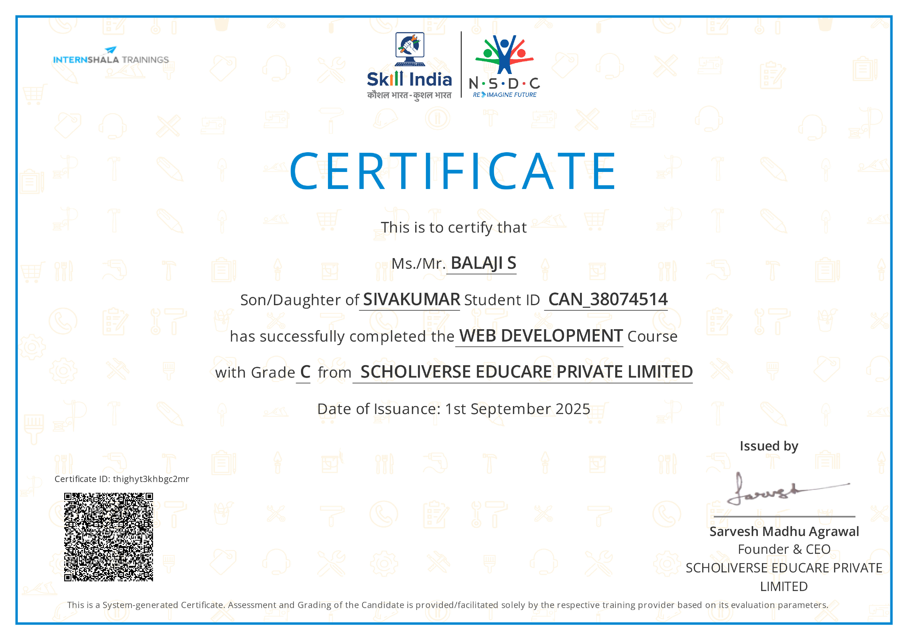

# 🔧 Portfolio Fixes Required

## Issues Identified from Screenshots:

### 1. ✅ Profile Photo
- **Current:** Showing placeholder SVG icon (blue gradient person icon)
- **Status:** This is acceptable as a placeholder
- **Action:** User can replace `assets/images/profile-placeholder.svg` with actual photo later

### 2. ❌ OpenWISP Project - REMOVE
- **Issue:** Project #3 "OpenWISP Monitoring" needs to be removed
- **Location:** projects.html line ~180-210
- **Action:** Delete entire project card section

### 3. ❌ Certificate Images Not Showing
- **Issue:** Most certificates showing placeholder instead of actual images
- **Available Images:**
  - ✅ data-analytics-essentials.png
  - ✅ introduction-to-data-science.png  
  - ✅ Databricks - Generic.png
  - ✅ Web_Development_Certificate.jpg
- **Action:** Update certificate image paths in certificates.html

### 4. ❌ Project Links Opening Directory Listings
- **Issue:** Clicking "View Files" opens directory listing instead of proper page
- **Cause:** Projects don't have index.html files, just folders with files
- **Solution:** Remove "View Files" buttons OR create README viewers

### 5. ❌ Project Folder Path Issues
- **Issue:** Some project paths incorrect
- **Current:** `Projects/Mini project - 2/`
- **Actual:** `Projects/IOT_BASED_SMART_ENERGY/`
- **Action:** Update paths in projects.html

### 6. ❌ Missing Project Images
- **Issue:** Several projects using placeholder images
- **Available Images:**
  - Bank Loan: ✅ Has dashboard screenshots
  - Fault Tolerant: ✅ Has schematic/output images
  - IoT Energy: ✅ Has pie chart images
  - Emotion Detection: ❌ No images found
  - Sales Dashboard: ❌ No images found

---

## Fix Implementation Plan:

### Fix 1: Remove OpenWISP Project from projects.html
```html
<!-- DELETE THIS ENTIRE SECTION (lines ~180-210) -->
<article class="project-card" data-aos="fade-up" data-aos-delay="300">
  <!-- OpenWISP content -->
</article>
```

### Fix 2: Update Certificate Images
Replace placeholder paths with actual certificate files:

```html
<!-- Data Analytics Essentials - ALREADY CORRECT -->


<!-- Introduction to Data Science - ALREADY CORRECT -->


<!-- Databricks - ALREADY CORRECT -->


<!-- Web Development - ALREADY CORRECT -->


<!-- NEED TO FIX: Other certificates showing placeholder -->
<!-- These PDFs need to be converted to images or kept as PDF links -->
```

### Fix 3: Remove "View Files" Buttons
Since clicking opens directory listings, remove these buttons:

```html
<!-- REMOVE THESE SECTIONS -->
<div class="project-links" style="margin-top: 1rem; display: flex; gap: 1rem;">
  <a href="Projects/..." class="btn btn-outline">
    <i class="fas fa-folder-open"></i> View Files
  </a>
</div>
```

### Fix 4: Update IoT Project Path
```html
<!-- CHANGE FROM: -->


<!-- CHANGE TO: -->

```

### Fix 5: Update Emotion Detection Path
```html
<!-- CHANGE FROM: -->
<a href="Projects/Mini project - 1/" class="btn btn-outline">

<!-- CHANGE TO: -->
<a href="Projects/VIDEO_BASED_EMOTION_DETECTION_USING_DEEP_LEARNING/" class="btn btn-outline">
```

### Fix 6: Update Project Stats
After removing OpenWISP, update stats:

```html
<!-- CHANGE FROM: -->
<div class="stat-number">6+</div>
<div class="stat-label">Major Projects</div>

<!-- CHANGE TO: -->
<div class="stat-number">5</div>
<div class="stat-label">Major Projects</div>
```

---

## Certificate Image Solutions:

### Option 1: Use PDF Viewer Links
For certificates that are PDFs, link to them directly:

```html
<div class="certificate-image">
  <a href="Certificates/Python_Certificate.pdf" target="_blank">
    
    <div class="pdf-overlay">
      <i class="fas fa-file-pdf"></i> View PDF
    </div>
  </a>
</div>
```

### Option 2: Create Placeholder with Icon
Use Font Awesome icons for certificates without images:

```html
<div class="certificate-image certificate-placeholder">
  <i class="fas fa-certificate fa-5x"></i>
  <p>PDF Certificate</p>
</div>
```

---

## Quick Fixes Summary:

1. **projects.html:**
   - Remove OpenWISP project card (lines ~180-210)
   - Remove all "View Files" buttons
   - Update IoT project image path
   - Update Emotion Detection project path
   - Change project count from "6+" to "5"

2. **certificates.html:**
   - Already has correct images for 4 certificates
   - Add PDF icons or links for remaining certificates

3. **Profile Photo:**
   - Current placeholder is acceptable
   - User can replace later with actual photo

---

## Files to Update:

1. ✅ `data/projects.json` - Already updated (OpenWISP removed)
2. ❌ `projects.html` - Needs updates
3. ❌ `certificates.html` - Minor updates for PDF certificates
4. ✅ `index.html` - No changes needed
5. ✅ `about.html` - No changes needed

---

## Testing After Fixes:

1. Navigate to Projects page
2. Verify only 5 projects show (no OpenWISP)
3. Verify no "View Files" buttons
4. Check all project images load
5. Navigate to Certificates page
6. Verify certificate images show correctly
7. Test certificate filtering

---

## Priority:

🔴 **HIGH:** Remove OpenWISP project
🔴 **HIGH:** Remove "View Files" buttons (causing directory listings)
🟡 **MEDIUM:** Update project paths
🟢 **LOW:** Certificate PDF handling
🟢 **LOW:** Profile photo (acceptable as-is)
