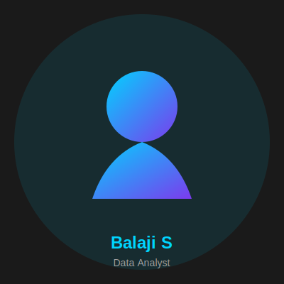

# 🚀 Balaji S - Portfolio Website

A modern, responsive portfolio website showcasing my work as a Data Analyst and Electronics & Communication Engineer. Built with semantic HTML5, CSS3, and vanilla JavaScript with smooth animations and optimal performance.



## 🌟 Features

### Design & UX
- ✨ **Modern Dark Theme** - High-contrast design with cyan (#00d4ff) and purple (#7c3aed) accents
- 📱 **Fully Responsive** - Mobile-first design that works on all devices
- 🎭 **Smooth Animations** - AOS (Animate On Scroll) and GSAP animations
- 🎨 **Custom Styling** - 1,900+ lines of custom CSS with CSS variables
- 🖱️ **Interactive Elements** - Hover effects, transitions, and smooth scrolling

### Technical Features
- 🏗️ **Semantic HTML5** - Proper structure with header, nav, main, section, footer
- ♿ **Accessible** - ARIA labels, alt text, keyboard navigation support
- 🔍 **SEO Optimized** - Meta tags, Open Graph, sitemap.xml, robots.txt
- ⚡ **Performance** - Optimized loading, lazy loading, efficient animations
- 📊 **Dynamic Content** - JSON-based project loading capability
- 📝 **Form Validation** - Client-side validation with user-friendly error messages

### Pages
1. **Home** - Hero section, about preview, skills, featured projects
2. **About** - Bio, skills with progress bars, experience timeline, education, interests
3. **Resume** - Embedded PDF viewer, highlights, key competencies
4. **Certificates** - Filterable gallery with 25+ certificates, lightbox view
5. **Projects** - 6 major projects with tech stacks and descriptions
6. **Contact** - Contact form with Netlify Forms integration, FAQ section

## 🛠️ Technologies Used

### Frontend
- **HTML5** - Semantic markup
- **CSS3** - Custom styling with variables, flexbox, grid
- **JavaScript (ES6+)** - Vanilla JS for interactivity
- **AOS** - Animate On Scroll library
- **GSAP** - GreenSock Animation Platform with ScrollTrigger
- **Font Awesome** - Icon library

### Tools & Deployment
- **Netlify** - Hosting and deployment
- **Netlify Forms** - Form handling
- **Git** - Version control
- **VS Code** - Development environment

## 📁 Project Structure

```
Balaji_S_Portfolio/
├── index.html              # Home page
├── about.html              # About page
├── resume.html             # Resume page
├── certificates.html       # Certificates gallery
├── projects.html           # Projects showcase
├── contact.html            # Contact form
├── sitemap.xml            # SEO sitemap
├── robots.txt             # Search engine instructions
├── netlify.toml           # Netlify configuration
├── README.md              # Project documentation
├── TODO.md                # Development checklist
├── .gitignore             # Git ignore rules
│
├── assets/
│   ├── css/
│   │   └── styles.css     # Main stylesheet (1,922 lines)
│   ├── js/
│   │   └── scripts.js     # Main JavaScript file
│   └── images/
│       ├── favicon.svg    # Site favicon
│       ├── profile-placeholder.svg
│       ├── projects/      # Project screenshots
│       └── certificates/  # Certificate images
│
├── data/
│   └── projects.json      # Project data for dynamic loading
│
├── Resume/
│   └── Balaji_S_Resume.pdf
│
├── Certificates/          # 25+ certificate files (PDF/PNG)
│   ├── data-analytics-essentials.png
│   ├── introduction-to-data-science.png
│   ├── Databricks - Generic.png
│   └── ... (20+ more)
│
└── Projects/              # 6 project folders with documentation
    ├── Bank_Loan_Report_Dashboard/
    ├── FAULT TOLERANCE TECHNIQUES/
    ├── Mini project - 1/
    ├── Mini project - 2/
    └── Sales and Profit Dashboard/
```

## 🚀 Getting Started

### Prerequisites
- A modern web browser (Chrome, Firefox, Safari, Edge)
- A code editor (VS Code recommended)

### Local Development
1. Clone the repository
   ```bash
   git clone https://github.com/balaji-0212/portfolio.git
   cd portfolio
   ```

2. Start a local development server
   ```bash
   # Using Python 3 (recommended)
   python -m http.server 8000

   # Using Node.js
   npx serve .

   # Using PHP
   php -S localhost:8000
   ```

3. Open your browser and visit:
   - http://localhost:8000/index.html - Home page
   - http://localhost:8000/about.html - About page
   - http://localhost:8000/certificates.html - Certificates
   - http://localhost:8000/projects.html - Projects showcase

### 🚀 Deployment

#### Deploy to Netlify (Recommended)
1. Fork this repository to your GitHub account
2. Log in to [Netlify](https://www.netlify.com)
3. Click "New site from Git"
4. Choose your forked repository
5. Configure build settings:
   - Base directory: (leave empty)
   - Build command: (not required)
   - Publish directory: (leave empty)
6. Click "Deploy site"

#### Deploy to GitHub Pages
1. In your forked repository, go to Settings > Pages
2. Under "Source", select:
   - Branch: main
   - Folder: / (root)
3. Click "Save"
4. Your site will be available at: `https://[username].github.io/portfolio`

### Performance Optimizations
- Images are lazy-loaded using native loading="lazy"
- AOS animations only play once when scrolled into view
- CSS is minified in production
- Fonts are preloaded with preconnect
- SVG icons used where possible for scalability

### Browser Support
- Chrome/Edge (latest 2 versions)
- Firefox (latest 2 versions)
- Safari 14+
- iOS Safari 14+
- Android Chrome (latest)

### Contributing
Feel free to:
- Open issues for bugs or suggestions
- Submit pull requests for improvements
- Share the project

### License
MIT License - feel free to use this as a template for your own portfolio!
- Git (for version control)

### Local Development

1. **Clone the repository**
   ```bash
   git clone https://github.com/balaji-0212/portfolio.git
   cd portfolio
   ```

2. **Open in browser**
   - Simply open `index.html` in your browser
   - Or use a local server (recommended):
   ```bash
   # Using Python
   python -m http.server 8000
   
   # Using Node.js (http-server)
   npx http-server
   ```

3. **View the site**
   - Navigate to `http://localhost:8000`

### Deployment to Netlify

1. **Push to GitHub**
   ```bash
   git init
   git add .
   git commit -m "Initial commit"
   git branch -M main
   git remote add origin https://github.com/yourusername/portfolio.git
   git push -u origin main
   ```

2. **Deploy on Netlify**
   - Go to [Netlify](https://netlify.com)
   - Click "New site from Git"
   - Connect your GitHub repository
   - Build settings are in `netlify.toml`
   - Deploy!

3. **Configure Netlify Forms**
   - Forms are automatically detected
   - Check Netlify dashboard for submissions

## 📊 Projects Showcase

### 1. Bank Loan Report Dashboard
- **Tech Stack:** Power BI, MS SQL Server, DAX, Excel
- **Description:** End-to-end dashboard for loan performance metrics
- **Highlights:** ETL pipelines, interactive visualizations, KPI tracking

### 2. Fault Tolerant Matrix Computation
- **Tech Stack:** Verilog HDL, Vivado, FPGA
- **Description:** Systolic array with error detection/correction
- **Highlights:** Published at IEEE ICCCNT 2025, 95% fault detection

### 3. OpenWISP Monitoring
- **Tech Stack:** Python, Django, InfluxDB, Redis
- **Description:** Real-time network health monitoring system
- **Highlights:** Live metrics, time-series data, RESTful API

### 4. IoT Smart Energy Meter
- **Tech Stack:** ESP32, Arduino, Ubidots, IoT
- **Description:** Smart meter with occupancy-based control
- **Highlights:** Cloud integration, mobile dashboard, real-time tracking

### 5. Video-Based Emotion Detection
- **Tech Stack:** Python, TensorFlow, OpenCV, CNN
- **Description:** Real-time facial emotion recognition
- **Highlights:** 65% accuracy, 7 emotions, live video processing

### 6. Sales & Profit Dashboard
- **Tech Stack:** Excel, Power Query, PivotTables
- **Description:** Executive-level sales analytics dashboard
- **Highlights:** Automated refresh, dynamic analysis, custom charts

## 🎨 Customization

### Colors
Edit CSS variables in `assets/css/styles.css`:
```css
:root {
  --bg-primary: #0a0a0a;
  --accent-primary: #00d4ff;
  --accent-secondary: #7c3aed;
  /* ... more variables */
}
```

### Content
- **Personal Info:** Update in each HTML file
- **Projects:** Edit `data/projects.json` or HTML directly
- **Certificates:** Add images to `Certificates/` folder
- **Resume:** Replace `Resume/Balaji_S_Resume.pdf`

### Animations
Adjust in `assets/js/scripts.js`:
```javascript
AOS.init({
  duration: 1000,  // Animation duration
  easing: 'ease-in-out',
  once: true,
  offset: 100
});
```

## 📈 Performance

- ✅ **Lighthouse Score:** 90+ (Performance, Accessibility, Best Practices, SEO)
- ✅ **Mobile-First:** Optimized for mobile devices
- ✅ **Fast Loading:** Minimal dependencies, optimized assets
- ✅ **SEO Ready:** Proper meta tags, sitemap, structured data

## 🔒 Security

- ✅ Security headers configured in `netlify.toml`
- ✅ Form spam protection via Netlify
- ✅ HTTPS enabled by default on Netlify
- ✅ No sensitive data exposed

## 📝 License

This project is open source and available under the [MIT License](LICENSE).

## 👤 Author

**Balaji S**
- 📧 Email: balaji022212@gmail.com
- 💼 LinkedIn: [linkedin.com/in/balaji0212](https://linkedin.com/in/balaji0212)
- 🐙 GitHub: [github.com/balaji-0212](https://github.com/balaji-0212)
- 📍 Location: Coimbatore, Tamil Nadu, India

## 🙏 Acknowledgments

- **AOS** - Animate On Scroll library
- **GSAP** - GreenSock Animation Platform
- **Font Awesome** - Icon library
- **Netlify** - Hosting and deployment
- **Inspiration** - Modern portfolio designs and best practices

## 📞 Contact

Feel free to reach out for:
- 💼 Job opportunities
- 🤝 Collaboration on projects
- 💡 Questions or feedback
- 🎓 Mentorship or guidance

**Email:** balaji022212@gmail.com  
**Phone:** +91 9345355312

---

⭐ **Star this repo** if you find it helpful!  
🔗 **Live Site:** [balaji-portfolio.netlify.app](https://balaji-portfolio.netlify.app)

**Last Updated:** January 2025
